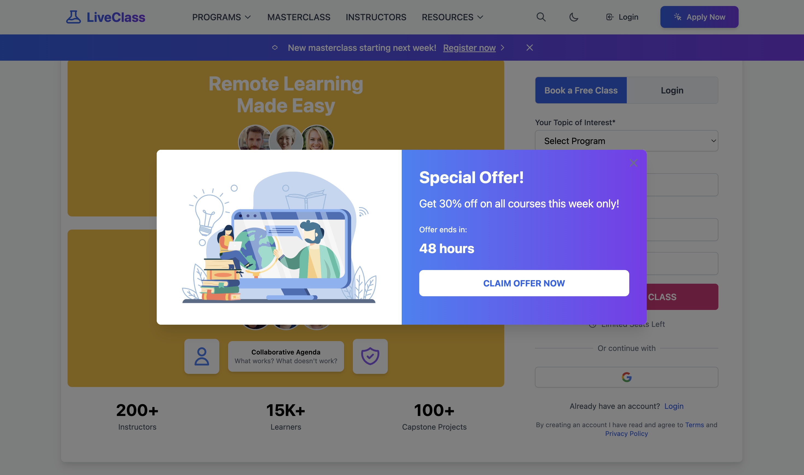
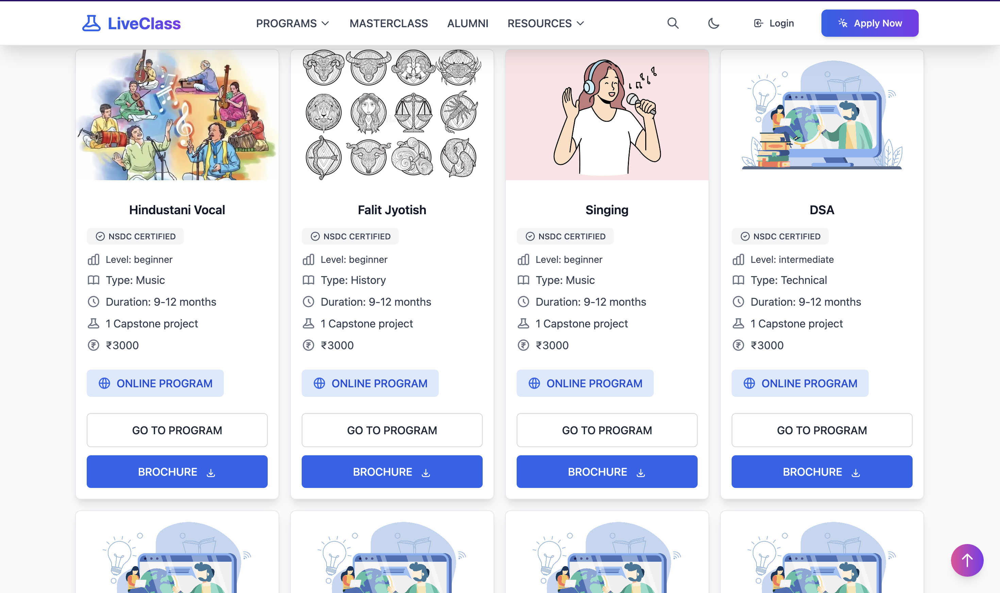

# LiveClass LMS System

## Overview
LiveClass is a modern Learning Management System (LMS) designed to facilitate online education and virtual classroom management. This system provides a robust platform for educators and students to interact in real-time, manage courses, and track academic progress.

## Features
- Real-time virtual classrooms
- Course management
- Student enrollment system
- Assignment submission and grading
- Progress tracking
- Interactive learning tools
- User authentication and authorization

## Technology Stack
- Backend: Go 1.24.0
- Frontend: 
  - HTMX for dynamic HTML updates
  - Alpine.js for client-side interactivity
- Database: PostgreSQL
- Template Engine: Go templates

## Getting Started

### Prerequisites
- Go 1.21 or higher
- PostgreSQL
- Air (Live reload for Go apps)

### Installation Steps

1. Clone the repository
```bash
git clone https://github.com/chinmayvivek/liveClass.git
cd liveClass
```

### DB Export
`pg_dump -U postgres liveclass > /liveClass/db/liveclass.sql`

### Screenshots

<div align="center">

|  |
|:--:|
| *LiveClass Website HomePage-1* |

|  |
|:--:|
| *LiveClass Website HomePage-2*  |

</div>