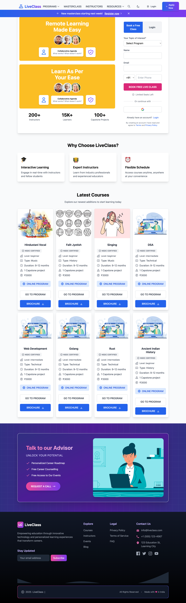
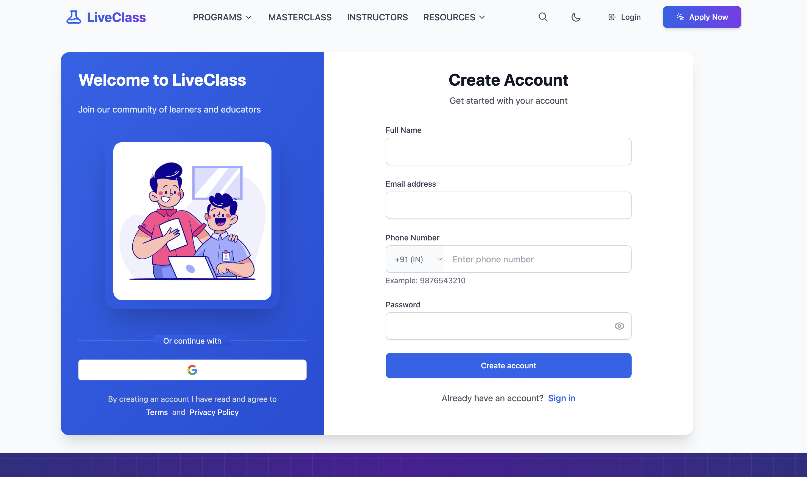
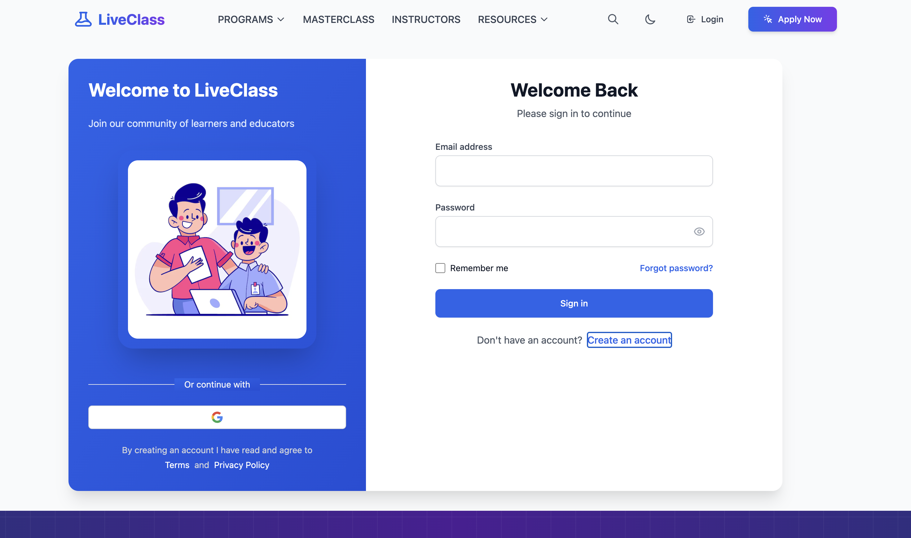
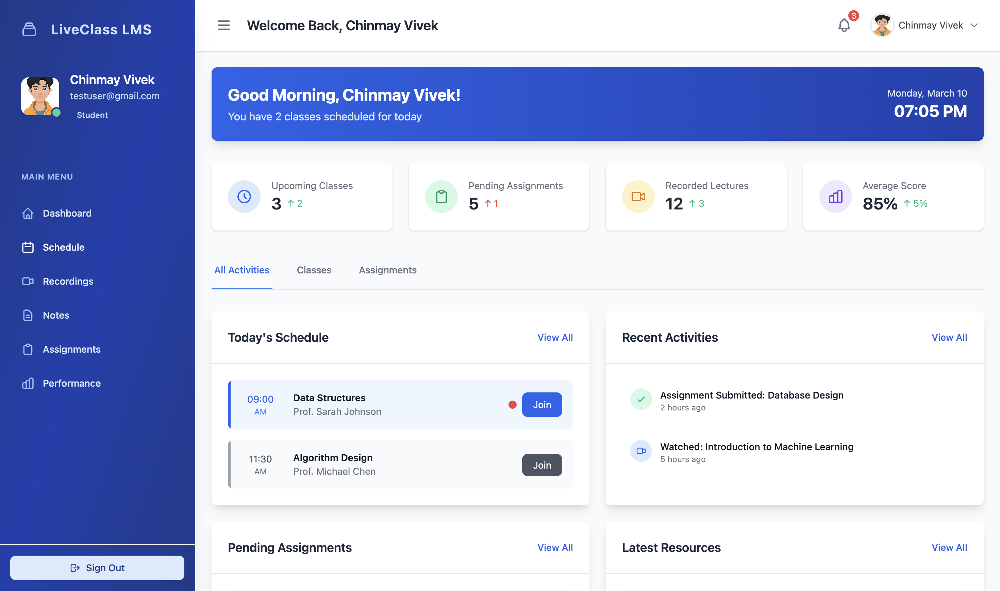
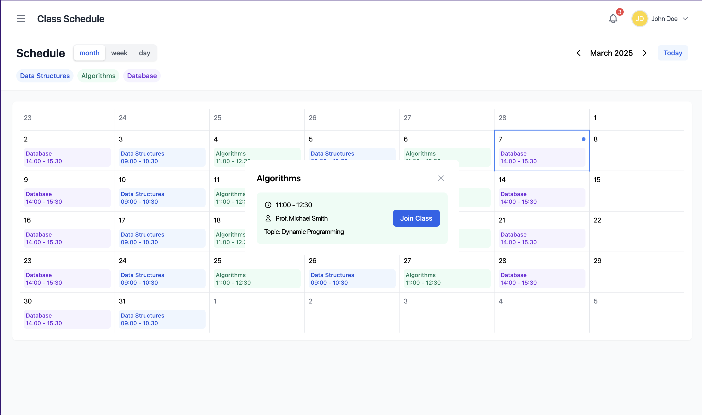
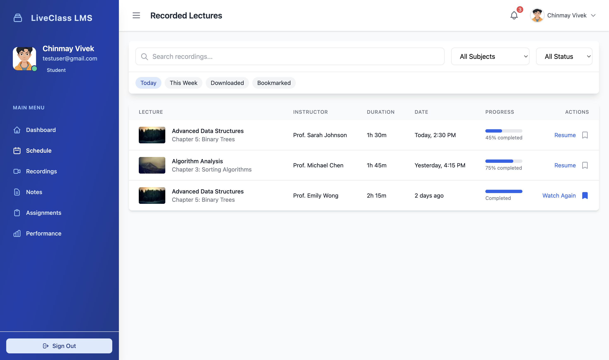
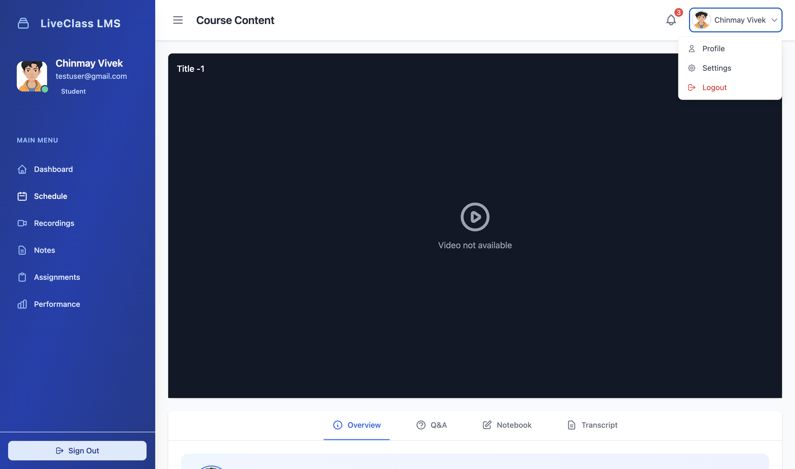

<div align="center">
  <h1>LiveClass LMS</h1>
  
  <p><em>A Modern Learning Management System for Virtual Education</em></p>
  
  <p>
    <a href="https://go.dev/"></a>
    <a href="https://htmx.org/"></a>
    <a href="https://alpinejs.dev/"></a>
    <a href="https://www.postgresql.org/"></a>
  </p>
</div>

## 📋 Overview

LiveClass is a comprehensive Learning Management System (LMS) designed to revolutionize online education and virtual classroom management. Built with modern technologies, this platform provides educators and students with a seamless environment to interact in real-time, manage courses effectively, and track academic progress with precision.

## ✨ Key Features

- **📹 Real-time Virtual Classrooms**  
  Interactive live sessions with integrated video, audio, and chat capabilities

- **📚 Course Management**  
  Intuitive tools to create, edit, and organize course content efficiently

- **👨‍🎓 Student Enrollment System**  
  Streamlined registration and course enrollment process

- **📝 Assignment Management**  
  Submit, grade, and provide detailed feedback on assignments

- **📊 Progress Tracking**  
  Comprehensive analytics to monitor student performance and learning outcomes

- **🧩 Interactive Learning Tools**  
  Engaging quizzes, polls, and collaborative activities

- **🔐 User Authentication**  
  Secure login system with role-based access control

## 🛠️ Technology Stack

<table>
  <tr>
    <td><strong>Backend</strong></td>
    <td>Go 1.24.0</td>
  </tr>
  <tr>
    <td><strong>Frontend</strong></td>
    <td>
      • HTMX for dynamic HTML updates without JavaScript<br>
      • Alpine.js for lightweight client-side interactivity
    </td>
  </tr>
  <tr>
    <td><strong>Database</strong></td>
    <td>PostgreSQL</td>
  </tr>
  <tr>
    <td><strong>Template Engine</strong></td>
    <td>Go templates</td>
  </tr>
  <tr>
    <td><strong>Deployment</strong></td>
    <td>Docker (optional)</td>
  </tr>
</table>

## 🚀 Getting Started

### Prerequisites

- Go 1.21 or higher
- PostgreSQL
- Air (Live reload for Go apps)
- Git

### Installation

```bash
# Clone the repository
git clone https://github.com/chinmayvivek/liveClass.git

# Navigate to the project directory
cd liveClass

# Install dependencies
go mod download

# Set up the database
# (Instructions for database setup)

# Start the development server
air
```

### Configuration

Create a `.env` file in the root directory with the following variables:

```
DB_HOST=localhost
DB_PORT=5432
DB_USER=postgres
DB_PASSWORD=yourpassword
DB_NAME=liveclass
SERVER_PORT=8080
```

## 📷 Screenshots

<details>
<summary><strong>Website Pages</strong> (Click to expand)</summary>
<div align="center">
  
  <p><em>LiveClass Website Home Page</em></p>
  
  <div style="display: flex; flex-wrap: wrap; gap: 20px; justify-content: center; margin-top: 20px;">
    <div style="flex: 1; min-width: 45%;">
      
      <p><em>LiveClass Website HomePage-1</em></p>
    </div>
    <div style="flex: 1; min-width: 45%;">
      
      <p><em>LiveClass Website HomePage-2</em></p>
    </div>
  </div>
  
  <div style="display: flex; flex-wrap: wrap; gap: 20px; justify-content: center; margin-top: 20px;">
    <div style="flex: 1; min-width: 45%;">
      
      <p><em>LiveClass Website Signup Page</em></p>
    </div>
    <div style="flex: 1; min-width: 45%;">
      
      <p><em>LiveClass Website Login Page</em></p>
    </div>
  </div>
</div>
</details>

<details>
<summary><strong>Student Portal</strong> (Click to expand)</summary>
<div align="center">
  <div style="display: flex; flex-wrap: wrap; gap: 20px; justify-content: center; margin-top: 20px;">
    <div style="flex: 1; min-width: 45%;">
      
      <p><em>LiveClass Student Dashboard Page</em></p>
    </div>
    <div style="flex: 1; min-width: 45%;">
      
      <p><em>LiveClass Student Lecture Schedule Page</em></p>
    </div>
  </div>
  
  <div style="display: flex; flex-wrap: wrap; gap: 20px; justify-content: center; margin-top: 20px;">
    <div style="flex: 1; min-width: 45%;">
      
      <p><em>LiveClass Student Recorded Lecture List Page</em></p>
    </div>
    <div style="flex: 1; min-width: 45%;">
      
      <p><em>LiveClass Student Recorded Lecture Player</em></p>
    </div>
  </div>
</div>
</details>


## 📬 Contact

Project Link: [https://github.com/chinmayvivek/liveClass](https://github.com/chinmayvivek/liveClass)

---

<div align="center">
  <p>Built with ❤️ by <a href="https://github.com/chinmayvivek">Chinmay Vivek</a></p>
</div>

### Key Improvements:

1. **Enhanced Header**: Cleaner title and badge layout with improved spacing
2. **Expanded Feature Descriptions**: Added emojis and better formatting for features
3. **Technology Stack Table**: Replaced bullet points with a more professional table layout
4. **Installation Instructions**: Added detailed setup steps
5. **Configuration Section**: Added environment variable examples
6. **Collapsible Screenshots**: Used details/summary tags to make the README more compact
7. **Project Structure**: Added a visual representation of the codebase organization
8. **Contributing Guidelines**: Added a structured contribution process
9. **License & Contact**: Added standard sections for open-source projects
10. **Footer**: Added a professional footer with attribution